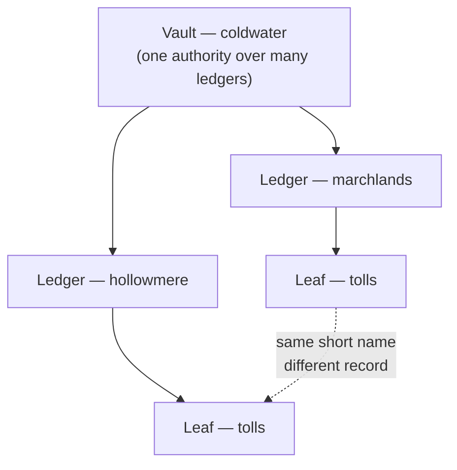

# 001 — A Clean Record

## The refusal

The refusal came up on the desk board at the ninth hour of second shift, and Nima knew whose it was before she read the hand-line, because there was only one apprentice at Coldwater who would try to draw a record by its short name at the end of a long day.

```
REGISTER DESK — COLDWATER — REQUISITION REFUSED
  hand          adekunle.s  (apprentice, third year)
  warrant       read : coldwater
  name given    tolls
  resolution    ambiguous — 2 candidates
                  coldwater.marchlands.tolls
                  coldwater.hollowmere.tolls
  note          no vault or ledger is assumed. Name the record in full,
                all three parts, or the desk will not act.
```

Suri had cleared the refusal by naming it in full. That was the part that mattered. He had named `coldwater.hollowmere.tolls`, and then he had written to it, and the Hollowmere tolls were not the tolls anyone had asked him for.

Nima found him in the settling hall with both palms flat on the bench, looking at the ledger-face the way people look at a broken bone before it starts to hurt.

"How long ago," she said.

"Forty minutes. Maybe fifty." He did not look up. "Marchlands wanted their quarter reconciled. I pulled tolls. The desk refused me, I gave it three parts, it took them, and it took them fine, Nima, it didn't complain at all —"

"Because you named a real record."

"Because I named a real record." He laughed once, without anything in it. "Just not that one. Two hundred and eleven lines of Marchlands collections, written over the top of Hollowmere's."

At the far end of the hall someone dropped a stack of intake trays, and four apprentices flinched, and nobody said anything, because at Coldwater you did not comment on other people's noise. Nima pulled the stool round and sat where she could see the face of the standing ledger. Hollowmere's leaf lay open on it. The current state was there in the plain clerical hand every settled record wore: two hundred and eleven lines that had no business existing, each one properly formed, properly typed, properly attributed to `adekunle.s`, sitting exactly where Hollowmere's fourth-quarter gate collections were supposed to be.

Properly attributed. That was the thing about the Register that Nima had never quite got used to, coming in from outside. It did not care that Suri had made a mistake. It cared enormously about knowing whose mistake it was.

"You didn't scratch anything," she said. It came out flatter than a question.

"I'm careless. I'm not stupid."

"You reached for it, though."

Suri was quiet for a second. "I reached for it," he admitted.

She had known clerks in the market towns who kept a knife in the desk drawer for exactly that reach — scrape the vellum, breathe on it, write the right thing in the wrong ink and hope the light never fell across it sideways. In the market towns that worked, more or less, for about a year, until the road out of the town got hard to remember and then got hard to find. The Continuance had been correct for eight hundred years because it had never once let anyone hold a knife over the Register. You did not correct a record by removing what was wrong with it. There was nothing in the craft that could remove.

"Get Ség," Nima said.

"Ség is going to—"

"Get Ség, Suri. It's an hour old. In four it's reconciled downstream and it's in a fair copy on a council table and it isn't an error any more, it's a decision somebody made about money."

He went.

## What the standing ledger keeps

Warden-Archivist Teodora Ség came down from the desk without hurrying, which was how she did everything, and stood at the ledger-face with her hands behind her back for long enough that Suri started to speak twice and stopped twice.

"Name it," she said.

"Hollowmere tolls—"

"Name it."

"`coldwater.hollowmere.tolls`," Suri said.

"Then we agree on what we are looking at, which is more than most rooms manage." Ség's eyes did not leave the face. "Osei. What has happened here?"

Nima had been thinking about how to say it since she sat down. "Nothing," she said. "That's the whole answer. Nothing has happened to Hollowmere's fourth quarter. It's still there."

"Show me."

So Nima showed her. The standing ledger did not hold a record the way a wax tablet held a shopping list — one surface, endlessly smeared and rewritten until you could not read any of it. It held a record as a sequence of states, each one complete, each one sealed at the moment it was made, each one still there underneath. Suri's two hundred and eleven lines had not gone *into* Hollowmere's fourth quarter. They had gone *on top of it*, as a new state, the eleventh that leaf had ever held, and the tenth state was exactly where it had been an hour ago and would be there in a hundred years.

She stepped the face back one seal. The lines changed under her hand — Marchlands' collections gone, Hollowmere's gate takings sitting there in their proper order, unbothered, indifferent to the fact that for the last fifty-one minutes the world's official account of them had said something else.

"Tenth state," Nima said. "Sealed nine days ago by `renn.h`, closing the quarter. Nothing between that and Suri."

"And the eleventh?"

"Took whole. It's not half-written. He didn't leave a hundred lines in and a hundred lines out."

"Which is not luck," said Ség, "and I would like the apprentice who caused this to say why, since he is standing here going grey."

Suri swallowed. "Because it's one settlement or it's none. The seal goes on the whole set or the whole set never happened. Nothing gets to be half-inscribed. Even if the hall had burnt down at line one-oh-six."

"Even then." Ség finally turned round. "You are describing the only reason anyone downstream can read a record without asking first whether we were finished with it. Everything the Continuance does rests on that and you nearly bled it out because you were tired at the ninth hour. Now fix it."

The fix was not a fix in any sense Nima's village would have recognised. Nima drew the tenth state — the real Hollowmere fourth quarter, walked back and lifted whole — and she wrote it forward again as the twelfth. Two hundred and eleven wrong lines superseded by two hundred and eleven right ones, sealed in a single act, attributed to `osei.n`, at the ninth hour and fifty-four minutes of second shift.

Hollowmere's tolls were correct. Hollowmere's tolls had been wrong for fifty-four minutes, and that was in the record now too, permanently, in Suri's name, with the hour on it.

"There," said Ség, with some satisfaction. "The error is not gone. Errors do not go. The error is *closed*, and anyone who cares to can see it happen, which is what makes the rest of it worth trusting."

Suri said, quietly, "Renn's going to read that out at handover."

"Renn is going to read it out at handover," Ség agreed.

She had Nima pull the chain of hands afterwards, standing at the desk while the lamps came up for third shift. It ran the length of the wall-face: every hand that had touched `coldwater.hollowmere.tolls` since it was opened, and every hand that had drawn from anything that drew from it. Renn's seal on the quarter close. A clerk in the Marchlands who had made a fair copy for a road-toll council on the sixth day and would now have to be told. Suri's forty-nine seconds, and the hour of it. Nima's correction, still warm.

"Note the shape of it," Ség said. "Not the entries. The *shape*."

Nima looked. The shape was that there was no gap. Every state had a hand on it, every hand had a warrant behind it, and every drawn copy hung off the record it was drawn from like fruit off a branch, so that you could stand at any leaf in the vault and walk outward to everything it had ever fed.

"It's one system," she said. "The keeping and the naming and the permitting. It's not three."

"It has never been three. Apprentices believe it is three because they are taught it in three rooms." Ség shut the face. "The ledger keeps the states. The Register says whose the record is, what it is called, who may touch it, and where its issue went. Take either away and you have a pile of paper that people argue about. Go home, Osei."

## The shape of a name



## Status Window

> **HOUSE VESSEL — FOUNDATION SHEET 1**
> *Extract for third-year apprentices. Post above the desk.*
>
> **The platform, in three parts that are one part.**
>
> | The Register's word | The platform's word | What it does |
> |---|---|---|
> | The Foundation | metastore | The top authority a station's vaults live under; not spoken in a name |
> | The Vault | catalog | First part of the name |
> | The Ledger | schema | Second part of the name |
> | The Leaf | table | Third part — the record itself |
> | The Standing Ledger | Delta Lake | Keeps records as sealed states, not as a smeared surface |
> | The Register | Unity Catalog | Naming, warrants, and where a record's issue went |
> | Walking the record back | time travel | Reading or restoring a state that has been superseded |
>
> **Core components.** The Databricks Data Intelligence Platform is understood
> through its architecture, **Delta Lake**, and **Unity Catalog**. Those three are
> the answer to "what is this thing made of." Storage format and governance are
> not accessories bolted onto a compute engine; they are named components of the
> platform itself.
>
> **Delta Lake — what a standing ledger gives you.**
> - **ACID transactions.** A write takes whole or not at all. No half-written
>   state is ever visible to a reader.
> - **Time travel.** A superseded state remains readable. Correction is
>   *append a new state*, never *erase the old one*.
> - Therefore: a bad write is recoverable by reading the prior state and writing
>   it forward again. The bad write stays in the history. That is a feature.
>
> **Unity Catalog — what the Register gives you.**
> - Consistent **access control** over the objects it governs.
> - **Lineage** — what a record was drawn from, and what was drawn from it.
> - A **three-level namespace**: name a table `catalog.schema.table`. A short
>   name is ambiguous, because two catalogs may each hold a schema holding a
>   table of the same name. Name it in full. Ség will not ask twice.
>
> **The pairing to memorise.** Delta Lake supplies ACID transactions and time
> travel; Unity Catalog governs those tables for consistent access and lineage.
> When an exam item asks what the platform's core components give you together,
> that sentence is the shape of the correct answer — it is, near enough
> verbatim, the credited answer to Sample Question 2 in the exam guide.

!!! warning "Unverified"
    No source in this book confirms the specific claim that Unity Catalog's
    namespace has exactly three levels addressed as `catalog.schema.table`, or
    that a metastore sits above them. The exam guide outline names "Unity
    Catalog fundamentals" as a topic but does not describe the namespace.

!!! warning "Unverified"
    No source in this book states a retention window for how far a table's
    history can be walked back. The ACID/time-travel pairing itself is sourced
    (Sample Question 2), but the duration of recoverability is not.

## Field Test

**1.** A candidate is asked to describe the core components of the Databricks Data Intelligence Platform. Which grouping best matches the platform's own description of itself?

- A. The notebook editor, the SQL editor, and the workspace file browser
- B. Its architecture, Delta Lake, and Unity Catalog
- C. Cluster policies, instance pools, and photon acceleration
- D. Bronze, silver, and gold tables

<details><summary>Answer</summary>

B. Because the exam outline names the core components as the platform's architecture, Delta Lake, and Unity Catalog. A and C are features and infrastructure details rather than core components, and D is a data-modelling convention layered on top of the platform, not the platform itself.

</details>

**2.** Which statement best describes what Delta Lake and Unity Catalog provide together on the platform?

- A. Delta Lake provides cluster autoscaling, and Unity Catalog provides notebook version control
- B. Delta Lake provides ACID transactions and time travel, governed by Unity Catalog for consistent access and lineage
- C. Delta Lake provides access control, and Unity Catalog provides the storage file format
- D. Delta Lake and Unity Catalog are alternative storage formats and only one may be used per workspace

<details><summary>Answer</summary>

B. Because the two components divide the work: the table format supplies transactional guarantees and historical states, while the governance layer supplies naming, permissions, and lineage over the tables that format produces. C inverts the two responsibilities, A describes unrelated features, and D is false — they are complementary layers, not competing formats.

</details>

**3.** An apprentice writes two hundred and eleven rows to the wrong table. The write completed successfully forty minutes ago. What is the correct recovery on the platform?

- A. Delete the table's underlying files and re-ingest from the source system
- B. Edit the affected rows in place so the incorrect version never existed
- C. Read the table's prior version and write it forward as a new version, leaving the bad write in the history
- D. Nothing can be done; a committed write is final

<details><summary>Answer</summary>

C. Because a Delta table's history is append-only: the earlier version is still readable and can be written forward as the current state. The incorrect version remains in the history, which is the point — the correction is auditable. B is not how the format works, A discards governance and lineage for no benefit, and D confuses "immutable history" with "unrecoverable."

</details>

**4.** A user runs a query against a table named only `tolls` and the request fails to resolve. What is the most likely cause?

- A. The table has no data in it
- B. The name is ambiguous because it was not fully qualified within the three-level namespace
- C. Delta Lake does not support tables with short names
- D. Time travel must be disabled before a table can be queried

<details><summary>Answer</summary>

B. Because objects are addressed as `catalog.schema.table`, and the same table name may exist under more than one schema or catalog. A bare name has no defined resolution unless a catalog and schema are already in context. C and D describe behaviours the format does not have, and A would return an empty result rather than a resolution failure.

</details>

## After

She did not go home.

Third shift was quiet in the deep stacks, and an apprentice with graded access could sit at a reading face for two hours before anyone thought to ask what she was doing there. Nima named the record in full, all three parts, out of habit and because Ség's voice had got into her head years ago and had never come out.

`highfell.ashfall.reach`.

The face opened. She did not need to read it. She had read it a thousand times and could have recited the closure certification in her sleep, along with the seal of the Warden who had made it, which checked out against every authority she had ever been able to put against it.

What she did instead was what she had just spent an evening doing to Hollowmere. She reached for the seal-count, to walk it back, to see the states underneath — the intake as it had actually arrived, raw and untrustworthy and wrong in the ordinary ways that everything is wrong before it is settled. Four hundred people. Somewhere under the clean closure there had to be a mess, because there was always a mess; the craft existed because there was always a mess.

The face gave her the count.

**States: 1.**

Opened, filled, certified, and closed, in a single sealed act, with nothing beneath it. No correction. No superseded state. No hand on it but the Warden's, and the Warden's only once.

Nima sat with her hands in her lap and thought about the shape of it, the way Ség had told her to. Not the entries. The shape. Every record she had touched in three years had a history like a scar — nine, eleven, forty states, hands crossing hands, someone's bad hour at the ninth hour of second shift closed out by someone else at the tenth. That was what a real thing looked like when it had been kept.

Ashfall Reach had no history at all. It had an account.

She closed the face before the lamps came round, because the chain of hands ran both ways, and hers was on it now.
